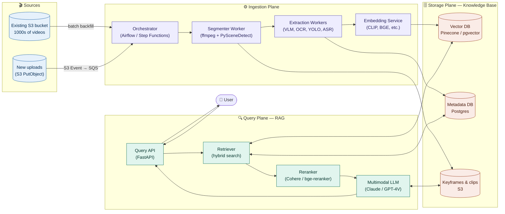
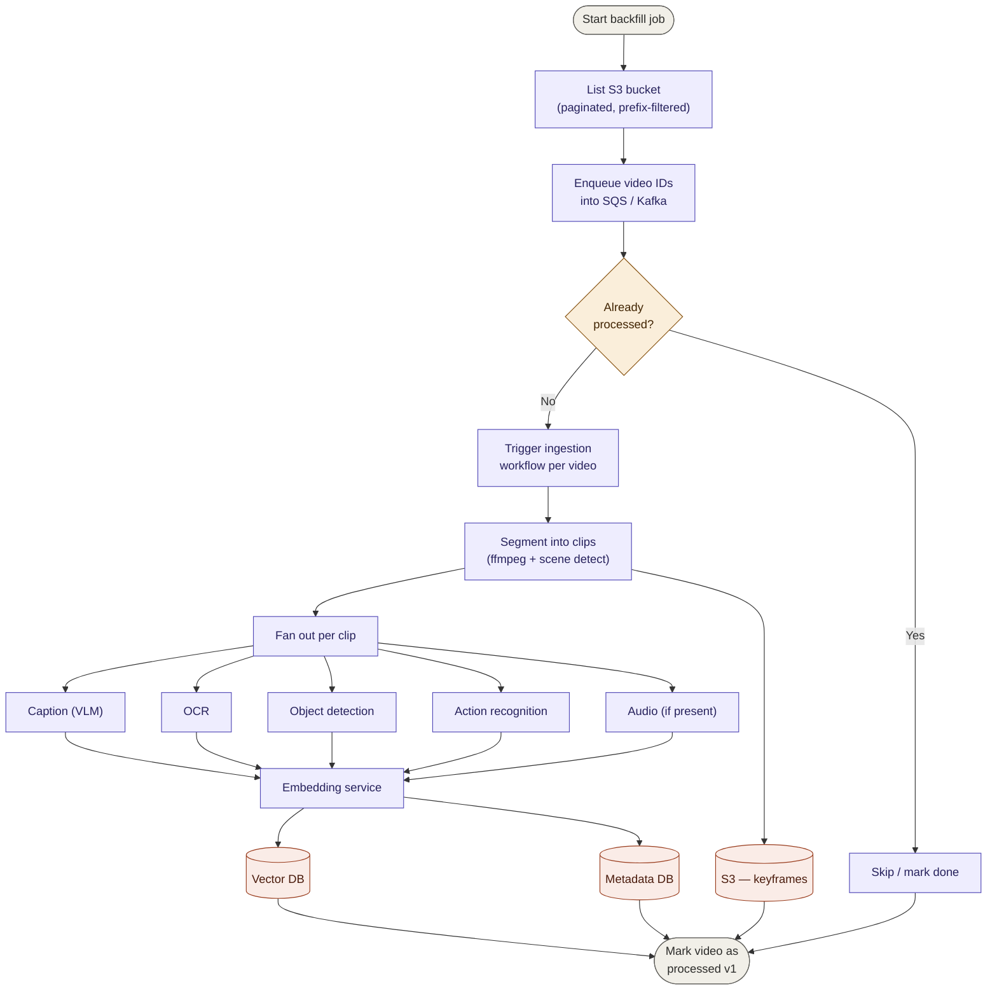
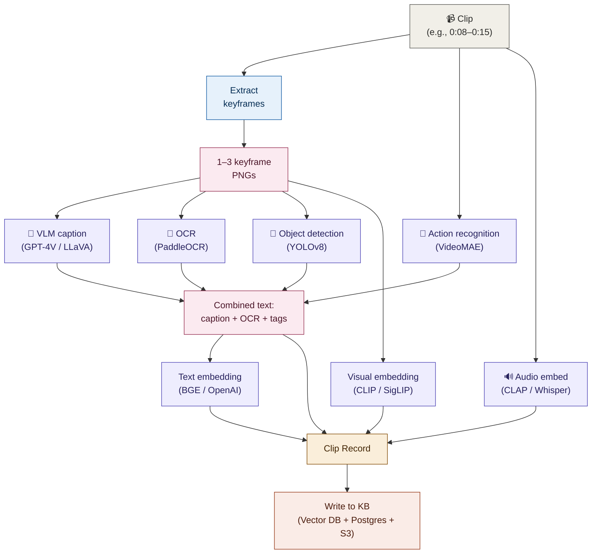
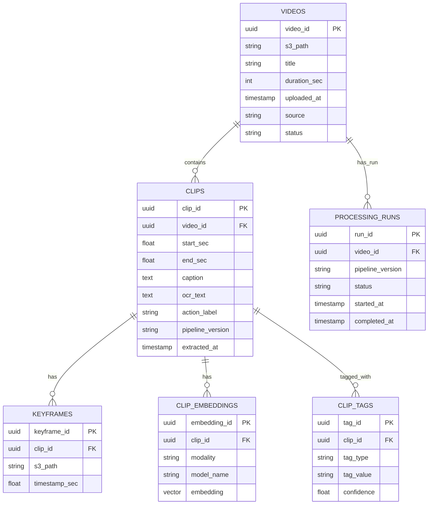
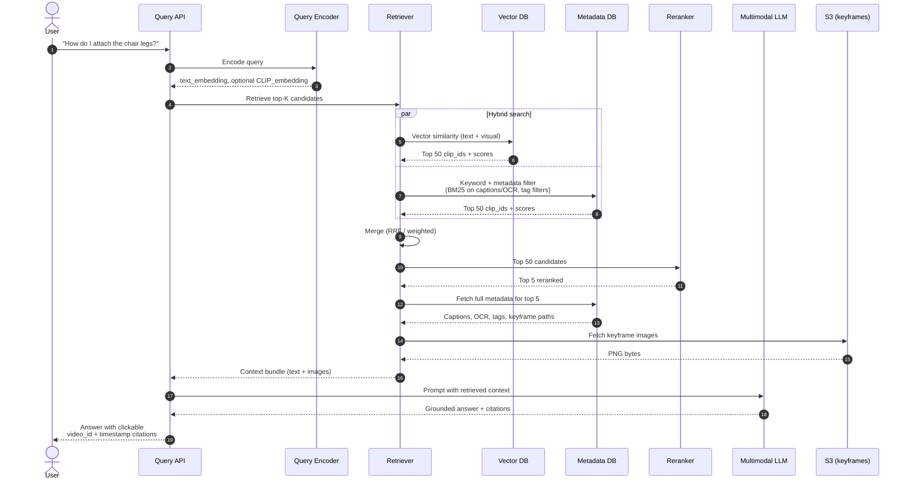
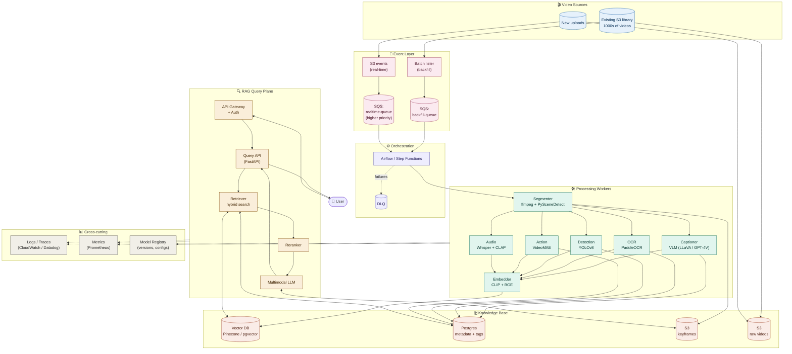
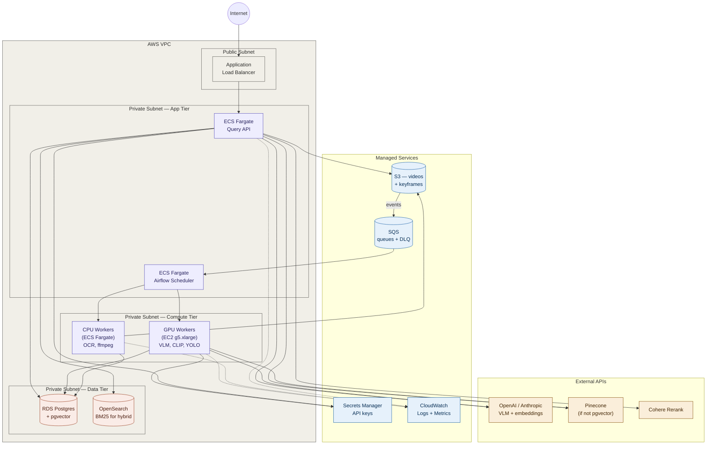

# Video RAG System — Architecture Blueprint

> **Purpose**: A starting-point reference architecture for a Retrieval-Augmented Generation (RAG) system whose knowledge base is built from a large library of videos — including silent / voiceless footage. Covers both **backfill** of existing S3 videos and a **real-time pipeline** for new uploads, plus the **query-side RAG flow**.

---

## Table of Contents

1. [System at a Glance](#1-system-at-a-glance)
2. [High-Level Architecture](#2-high-level-architecture)
3. [Service Catalog](#3-service-catalog)
4. [Pipeline A — Backfill of Existing S3 Videos](#4-pipeline-a--backfill-of-existing-s3-videos)
5. [Pipeline B — Real-Time Ingestion of New Videos](#5-pipeline-b--real-time-ingestion-of-new-videos)
6. [Per-Clip Extraction Pipeline (Detail)](#6-per-clip-extraction-pipeline-detail)
7. [Knowledge Base Data Model](#7-knowledge-base-data-model)
8. [RAG Query Flow](#8-rag-query-flow)
9. [End-to-End Integrated View](#9-end-to-end-integrated-view)
10. [Deployment Topology (AWS Reference)](#10-deployment-topology-aws-reference)
11. [Tech Stack Summary](#11-tech-stack-summary)
12. [Operational Concerns](#12-operational-concerns)
13. [Build Sequence Recommendation](#13-build-sequence-recommendation)

---

## 1. System at a Glance

The system has three logical planes:

| Plane | Purpose | Runs When |
|---|---|---|
| **Ingestion Plane** | Turns raw videos into searchable artifacts (captions, OCR, embeddings, metadata). | Once per video (backfill) + continuously (new uploads). |
| **Storage Plane** | Holds embeddings, metadata, keyframes, and raw video. The "knowledge base." | Always — read-heavy. |
| **Query Plane (RAG)** | Takes a user question, retrieves relevant clips, generates an answer. | On every user query. |

The same knowledge base powers every query. Videos are processed **once**; they are not re-read at query time.

---

## 2. High-Level Architecture



---

## 3. Service Catalog

| Service | Technology Choices | Responsibility |
|---|---|---|
| **Orchestrator** | Apache Airflow, Prefect, AWS Step Functions, Temporal | Schedule, retry, and track ingestion jobs. Owns idempotency and dead-letter handling. |
| **Segmenter** | ffmpeg + PySceneDetect (shot detection) or fixed-window slicing | Cuts each video into clips (5–10s windows or scene-bounded). Extracts 1–3 keyframes per clip. |
| **Captioning Worker** | GPT-4V, Claude (vision), Gemini, LLaVA, Qwen-VL, InternVL | Generates rich natural-language captions from keyframes / clips. Critical for voiceless videos. |
| **OCR Worker** | PaddleOCR, Tesseract, AWS Textract | Extracts on-screen text — labels, captions, code, UI elements. Often the single best signal. |
| **Detection Worker** | YOLOv8/v11, Grounding DINO (open-vocab) | Detects and tags objects per keyframe. |
| **Action Recognition Worker** | VideoMAE, SlowFast, TimeSformer, X-CLIP | Assigns activity labels to clips ("assembling," "pouring," "drilling"). |
| **Audio Worker** | Whisper (ASR), CLAP / AudioCLIP (non-speech) | Transcribes speech where present; embeds ambient/non-speech audio. |
| **Embedding Service** | OpenAI text-embedding-3, Cohere, BGE, E5 (text) · CLIP, SigLIP, VideoCLIP, InternVideo (visual) | Converts captions and frames into vectors. |
| **Vector DB** | Pinecone, Weaviate, Qdrant, Milvus, pgvector | Stores and indexes embeddings for similarity search. |
| **Metadata DB** | PostgreSQL (or DynamoDB) | Stores structured per-clip metadata: video_id, timestamps, captions, tags, OCR text, model versions. |
| **Asset Store** | Amazon S3 | Raw videos, keyframes, clip files. Accessed by URL at query time. |
| **Query API** | FastAPI, Node/Express | Public-facing endpoint. Handles auth, rate limiting, request validation. |
| **Retriever** | Custom service over Vector DB + Postgres | Performs hybrid search (vector + keyword + metadata filters). |
| **Reranker** | Cohere Rerank, bge-reranker-large | Reorders top-N candidates for relevance. Highest-leverage quality improvement. |
| **Multimodal LLM** | Claude with vision, GPT-4V, Gemini | Generates final answer using retrieved captions + actual keyframe images as context. |

---

## 4. Pipeline A — Backfill of Existing S3 Videos

**Goal**: Process the existing 1000s of videos sitting in S3 today. Runs as a one-off (or periodic) batch job, separate from the real-time path so it doesn't choke new uploads.



**Key design notes for backfill:**
- **Idempotency check first** — a `processed_videos` table tracks `video_id`, `pipeline_version`, `processed_at`. Re-runs skip completed videos.
- **Throughput control** — the queue depth is the throttle. Workers auto-scale based on SQS depth, but bounded by VLM API rate limits.
- **Failure isolation** — if captioning fails for one clip, the rest of the artifacts for that clip still get stored. The clip is marked "partial" and can be re-tried later.
- **Pipeline versioning** — every artifact records the model/version used. When you upgrade the VLM, you can selectively re-process without re-segmenting.

---

## 5. Pipeline B — Real-Time Ingestion of New Videos

**Goal**: Whenever a new video lands in S3, it flows through the same processing stack automatically.

```mermaid
flowchart LR
    UPLOAD["📤 New video<br/>uploaded to S3"] -->|S3:ObjectCreated| EVT["S3 Event Notification"]
    EVT --> SQS[("SQS Queue<br/>(new-videos)")]
    SQS --> LAMBDA["Lambda dispatcher"]
    LAMBDA --> ORCH["Orchestrator<br/>workflow start"]

    ORCH --> PIPELINE["Same ingestion<br/>pipeline as backfill"]
    PIPELINE --> KB[("Knowledge Base")]

    KB --> NOTIFY["Optional:<br/>publish 'video-ready' event"]
    NOTIFY --> CONSUMERS["Downstream consumers<br/>(UI refresh, search index, etc.)"]

    classDef event fill:#E6F1FB,stroke:#185FA5,color:#042C53
    classDef proc fill:#EEEDFE,stroke:#534AB7,color:#26215C
    classDef store fill:#FAECE7,stroke:#993C1D,color:#4A1B0C
    class UPLOAD,EVT,SQS,LAMBDA,NOTIFY,CONSUMERS event
    class ORCH,PIPELINE proc
    class KB store
```



**Key design notes for real-time:**
- **Same workers, different priority queue** — new uploads go on a higher-priority queue than backfill items so freshly-uploaded videos appear in search quickly.
- **Dead-letter queue** — failed messages after N retries go to a DLQ for manual investigation. Don't silently drop.
- **Eventual consistency window** — a video is queryable ~minutes after upload (depends on length + VLM latency). Surface a "processing" state in your UI for newly-uploaded videos.

---

## 6. Per-Clip Extraction Pipeline (Detail)

The fan-out step is where most of the interesting work happens. Each clip independently passes through several extractors in parallel.



**What gets produced per clip:**

```json
{
  "clip_id": "vid_001_clip_003",
  "video_id": "vid_001",
  "start_sec": 8.2,
  "end_sec": 15.7,
  "keyframe_s3_paths": ["s3://.../vid_001/kf_003_a.png", "..."],
  "caption": "A person assembles a wooden chair on a workbench, attaching legs with a power drill.",
  "ocr_text": "Step 2: Pre-drill pilot holes",
  "objects": ["person", "chair", "drill", "screws"],
  "action": "assembling_furniture",
  "audio_tags": ["power_tool", "wood_impact"],
  "text_embedding": [0.23, -0.11, ...],
  "visual_embedding": [0.45, 0.08, ...],
  "audio_embedding": [0.12, -0.34, ...],
  "pipeline_version": "v1.2",
  "extracted_at": "2026-06-01T10:23:00Z"
}
```

---

## 7. Knowledge Base Data Model



**Storage layout in practice:**
- `videos`, `clips`, `keyframes`, `clip_tags`, `processing_runs` → **Postgres** (relational, filterable).
- `clip_embeddings` → **Vector DB** (Pinecone/Qdrant/pgvector). The `clip_id` is the foreign key linking back to Postgres.
- Actual video files and keyframe PNGs → **S3**, referenced by URL.

---

## 8. RAG Query Flow



**Why each step earns its place:**
- **Hybrid retrieval** — pure vector misses exact-keyword matches (model names, error codes, on-screen text). BM25 catches those. Combining beats either alone.
- **Reranker** — recall is high after retrieval (top 50) but precision matters for the LLM context. A cross-encoder reranker is the single best quality-per-dollar addition.
- **Pass keyframes to the LLM, not just text** — the LLM can correct caption errors when it can see the frame itself. Skipping this leaves easy quality on the table.
- **Citations as `video_id` + timestamp** — let users jump to `https://your-player/v/{video_id}?t={start_sec}`. Trust comes from verifiability.

---

## 9. End-to-End Integrated View



---

## 10. Deployment Topology (AWS Reference)

A concrete deployment example using AWS services. Substitute equivalents for GCP/Azure as needed.



**Deployment notes:**
- **GPU workers** stay in an autoscaling group with min=0 during quiet periods. They're the expensive ones.
- **CPU workers** (ffmpeg, OCR) run on cheap Fargate spot.
- **Vector DB choice**: start with pgvector for simplicity (one less service), graduate to Pinecone/Qdrant if scale demands it (~10M+ vectors).
- **OpenSearch** is optional — only needed if you want strong BM25 alongside vector. pgvector + Postgres FTS can cover early-stage hybrid search.

---

## 11. Tech Stack Summary

| Layer | Choice (Starter) | Choice (Scale) |
|---|---|---|
| **Orchestration** | Airflow (self-hosted) | Step Functions or Temporal |
| **Segmentation** | ffmpeg + PySceneDetect | Same, GPU-accelerated |
| **VLM Captioning** | Claude / GPT-4V API | Self-hosted LLaVA / InternVL on GPU fleet |
| **OCR** | PaddleOCR | Same |
| **Object Detection** | YOLOv8 | YOLOv8 + Grounding DINO |
| **Action Recognition** | VideoMAE | InternVideo |
| **Speech ASR** | Whisper (local or API) | Whisper-large-v3 self-hosted |
| **Non-speech Audio** | CLAP | Same |
| **Text Embeddings** | OpenAI text-embedding-3-small | BGE / E5 self-hosted |
| **Visual Embeddings** | CLIP ViT-B/32 | SigLIP or InternVideo |
| **Vector DB** | pgvector | Pinecone / Qdrant |
| **Metadata DB** | Postgres | Postgres (RDS) |
| **Asset Store** | S3 | S3 |
| **Reranker** | Cohere Rerank API | bge-reranker-large self-hosted |
| **Generation LLM** | Claude / GPT-4V | Same, optionally fine-tuned |
| **API** | FastAPI on ECS Fargate | Same |
| **Observability** | CloudWatch + OpenTelemetry | Datadog / Honeycomb |

---

## 12. Operational Concerns

### Cost control
- **VLM captioning is the dominant cost.** Sample keyframes aggressively — 1 keyframe per detected scene, not 1 per second.
- **Cache aggressively.** Caption is a function of `(keyframe_hash, model_version, prompt_version)`. Hash the image bytes and skip re-captioning unchanged frames.
- **Tiered processing.** Cheap extractors (OCR, YOLO) run first; expensive VLM captioning only on clips where cheap extractors found "something worth describing."

### Pipeline versioning
- Every artifact records `pipeline_version`, `model_name`, `model_version`.
- Re-processing is selective: "re-caption all clips where `captioner_version < v2.3`" — don't re-segment or re-embed unnecessarily.
- Maintain a `pipeline_manifest.yaml` in the repo enumerating every model and version in the active pipeline.

### Evaluation harness
- Build a **golden set** of 30–50 (query, expected_clip_id) pairs covering your video domain.
- Run it on every pipeline change. Track:
  - **Recall@5** — did the right clip make the top 5?
  - **MRR** — mean reciprocal rank of the right clip.
  - **Answer faithfulness** — does the LLM answer match the retrieved evidence? (LLM-as-judge or manual review.)
- Without this, you're flying blind on every change.

### Observability
- **Per-stage latency histograms** (segmentation, captioning, embedding, retrieval, generation).
- **Per-model error rates** with reasoning (rate limit vs. timeout vs. content filter).
- **Cost-per-video and cost-per-query** dashboards from day one.
- **Trace IDs** propagated from S3 event → final answer for end-to-end debugging.

### Security & access
- Videos may contain sensitive content. PII-aware processing: optional face/license-plate blurring before captioning.
- Knowledge base access scoped by user/tenant — the retriever filters by `tenant_id` before vector search.
- Signed URLs for keyframe access (no public S3).

---

## 13. Build Sequence Recommendation

Do **not** build all of this at once. Vertical slice first.

### Phase 0 — Spike (1 week)
- Pick 10 representative videos.
- Run ffmpeg → keyframes → Claude/GPT-4V captioning → text embedding → pgvector.
- Build a 10-line Python script that takes a query, retrieves top 3, returns the answer.
- **Goal**: prove the captions are usable. If captions are weak here, no amount of architecture saves you.

### Phase 1 — MVP (3–4 weeks)
- Add OCR, basic metadata DB, real-time S3 event ingestion for new uploads.
- Backfill 100 videos (not all 1000+).
- Stand up the Query API and a basic UI for evaluation.
- Build the golden-set eval harness.

### Phase 2 — Productionize (4–6 weeks)
- Add reranking, hybrid search (Postgres FTS or OpenSearch).
- Add object/action recognition workers.
- Implement pipeline versioning and processing run tracking.
- Backfill the full library.
- Stand up monitoring.

### Phase 3 — Scale & Quality (ongoing)
- Migrate to self-hosted VLM if costs justify it.
- Migrate vector store if pgvector hits limits.
- Multi-tenant isolation, audit logs, advanced caching.
- Fine-tune embeddings on domain-specific data.

---

## Appendix — Glossary

- **VLM** (Vision-Language Model): A model that takes images and text and produces text (e.g., GPT-4V, Claude with vision, LLaVA).
- **Embedding**: A vector representation of text, image, or audio used for similarity search.
- **Hybrid search**: Combining vector similarity with keyword/BM25 search; usually outperforms either alone.
- **Reranker**: A second-stage model that reorders an initial candidate list for relevance. Typically a cross-encoder.
- **Keyframe**: A single representative frame extracted from a clip.
- **Clip**: A short temporal segment of a video (e.g., 5–10 seconds), the atomic unit of the knowledge base.
- **Pipeline version**: A label tying an artifact to the specific configuration (models, prompts, parameters) that produced it.

---

*This document is a starting blueprint. Adapt naming, technology choices, and topology to match your team's existing infrastructure and your videos' specific characteristics.*
